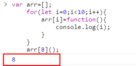

<h1>ES6的新特性</h1>

<strong>ES6新增的关键字</strong>
<ul>
<li><strong>新增的let关键字（申明变量,与var相似）</strong> 

    1、用let变量仅在自己的块级作用域起作用，出了这个块级作用域就不起作用 
     &nbsp;将var换成let后：&nbsp;
    

    2、用let变量不会出现变量提升的现象 
     var的变量提升 相当于
     换成 let后 a的值是not defined 
    

    3、注意事项：同一个块级内不能重复定义否则会报错 
    函数内不能用let申明函数的参数也会报错 
     
    总结：用let声明变量只在块级作用域起作用，适合在for循环使用，也不会出现变量提升现象。同一个代码块内，不可重复声明的相同变量，不可重复声明函数内的参数。 
</li>
<li><strong>ES6新增关键字const（申明变量,与let相似，但专门是用来申明常量的,就是申明不可改变的常量）</strong> 
    

    特点：1、不可修改 
     
    2:只在块级作用域内有作用与let一样; 
     
    3:不存在变量提升与let一样; 
     
    4:不可重复声名同一个变量与let一样; 
     
    5:声名后必须赋值; 
      
    6：如果常量是一个对象呢？（传址赋值） 
         
</li>
<li><strong>解构赋值(从数组和对象中提取值，对变量进行赋值,这种赋值成为解构赋值)</strong> 
    

    1,先了解解构赋值与传统赋值 
     
    2,解构赋值可以嵌套 
     
    3,不完全赋值 
      
    4,赋值不成功，变量的值为undefined 
      
    5,允许设定默认值 
       
    6,对象的解构赋值(如果变量找不到相同的属性则值为undefined)  
     也可以用变量名与属性名不一样的结构赋值 
    7,字符串的结构赋值 
    

    1,解构赋值的用处(交换临时变量):
     
    2,提取函数返回的多个值： 
    3,定义函数参数： 
    4,设置函数参数的默认值：
</li>
</ul>
