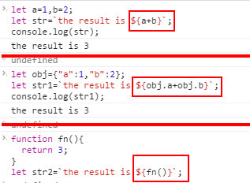
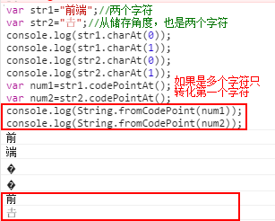

<h3>ES6的新特性</h3>

<ol>
<li><strong>ES6的string的特性学习</strong> 
    <h4>1，字符串的扩展(模板字符串)</h4>
    传统的字符串实现拼接时，要交变量插入字符串中： 
     
    <h4>2,模板字符串可以定义多行字符串</h4>
     
    但是值得注意的是：模板字符串的所有换行和空格都会保留在输出中 
     
    <h4>3,${}中可以放任意的javascript表达式(可以是表达式，函数的调用，对象的属性)</h4>
    
    <h4>4,字符串的扩展(标签模板) 
    模板指的是上面讲的字符串模板，用反引号定义的字符串；而标签，则指的是一个函数，一个专门处理模板字符串的函数。
    </h4>
    
tagfn函数的调用不太一样，分别是arr,v1,v2。这种对应顺序

    
    <h4>5,字符串的扩展(repeat函数)</h4>
    
repeat()函数：将目标重复n此，返回一个新的字符串，不影响目标字符串

    
    <h4>6,字符串的扩展(includes()函数)</h4>
    
includes()函数:判断字符串是否含有目标字符串，有则返回true，否则返回false，第二个参数可选，表示搜索位置

    
    <h4>6,字符串的扩展(startsWith()函数)</h4>
    
startsWith()函数:判断子字符串是否出现在目标字符串的开头位置，是则返回true，否则返回false，第二个参数可选，表示从N位开始

    
    <h4>7,字符串的扩展(endsWith()函数)</h4>
    
endsWith()函数:判子字符串是否出现在目标字符串的尾部位置，是则返回true，否则返回false，第二个参数可选，表示针对前N个字符

    
    <h4>8,字符串的扩展(codePointAt()函数)</h4>
    
codePointAt()函数:返回字节的十进制数

    
    <h4>9,字符串的扩展(String.fromCodePoint()函数)</h4>
    
String.fromCodePoint()函数:函数的参数是一个字符对应的码点，返回的结果就是对应的字符，哪怕这个字符是一个4字节的字符，也能正确实现。

    
    <h4>10,字符串的扩展(String.raw()函数)</h4>
    
String.raw()函数:raw是未加工的的意思，所以这个函数时返回字符串最原始的样貌，即使字符串中含有转义符，它都视而不见，直接输出

    
    </li>
</ol>