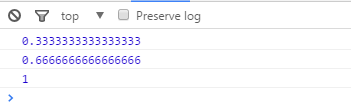

<h3>H5的图片预加载 提升用户体验</h3>

当用户打开H5的时候，不是立即显示第一屏，而是先显示资源加载效果，等加载完毕再显示页面的主内容。

<ul>
<li>进度问题 
进度的实现方式有两种，第一是已加载的数据大小/总的数据大小，第二是已加载的文件数/总的文件数。第一种难以实现，一般采用第二种。
</li>
<li>图片加载失败的问题 
比如说有四张图片，已经加载了两张进度条为50%，此时加载第三张出错了，怎么办呢？ 
进度条还是应该增加为75%，不然就无法加载到100%阅览内容了。图片加载失败不应该影响加载器的功能。
</li>
<li>图片加载超时的问题 
图片不能加载太久，否则用户一直停留在加载效果上，看不到主内容，所以应该给每个图片设置加载的超时时间，如果在所有的图片超时时间之后，还没有加载完，就应该主动放弃(某些特殊情况例外)。
</li>
</ul>

提供的基本实现方案是：

<pre>
(function(){
        /*判断传入的@arr是否是数组 返回值false or  arr*/
        function isArray(arr){
            return Object.prototype.toString.call(arr) === '[object Array]';
        }

        /*
         * @param imgList 要加载的图片地址列表，['aa/asd.png','aa/xxx.png']
         * @param callback 每成功加载一个图片之后的回调，并传入“已加载的图片总数/要加载的图片总数”表示进度
         * @param timeout 每个图片加载的超时时间，默认为5s
         */
        var loader=function(imgList, callback, timeout){
            timeout=timeout||500;
            callback=typeof (callback) ==='function' && callback;
            imgList=isArray(imgList) && imgList ||[];

            var total=imgList.length,
                loaded= 0,
                images=[],
                _on=function(){
                   loaded <total && (++loaded,callback && callback(loaded/total));
                };
            /*_on函数时判断图片是否加载  并执行callback函数*/
            for(var i=0;i<total;i++){
                images[i]=new Image();
                images[i].onload=images[i].onerror=_on;
                images[i].src=imgList[i];
            }
            /*
             * 如果timeout * total时间范围内，仍有图片未加载出来（判断条件是loaded < total），通知外部环境所有图片均已加载
             * 目的是避免用户等待时间过长
             */
            setTimeout(function(){
                loaded <total && (loaded=total,callback && callback(loaded/total));
            },timeout*total);
        };
        window.imgloader=loader;
    })()
</pre>

使用这个函数

<pre>
    /*回掉函数可以完善*/
    imgloader(['http://170.240.100.147/wstmall/yishu/347/121/01.jpg', 'http://170.240.100.147/wstmall/yishu/347/117/117_01.jpg', 'http://170.240.100.147/wstmall/yishu/347/124/124_01.jpg'], function(percentage){
        console.log(percentage)
    })
</pre>

结果：

