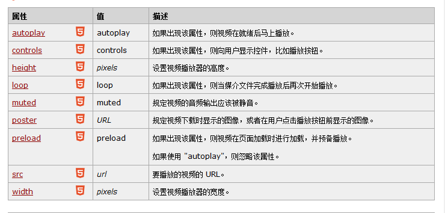
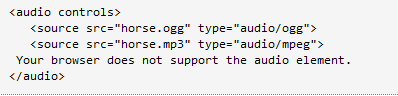
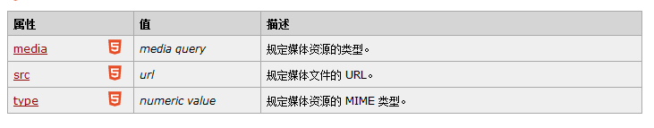

<h2>video学习</h2>

<ol>
<li>标签属性： </li>
<li>src属性：播放视频链接（一定要选择ios与安卓,pc端都支持的视频格式比如MP4）例如：.OGG格式ios不支持 
也可使用source标签来选择链接(source可以拥有多分源文件的音频播放器)让浏览器自己选择支持的格式  
 
其中source标签属性有：(video与audio的source标签一样) 

</li>
<li>video在页面播放后（在安卓手机中 层级关系将变得最高）会挡住其他覆盖元素。 
我的处理办法：在播放视频关闭后，将视频隐藏，设置一个视频的默认图片覆盖，需要播放时再显示视频
</li>
<li>video的事件处理事件： 
jquery只能采用选择器来选取video标签，并没有直接控制video元素的播放，暂停等方法，需要使用原生的javascript来控制
 
<a href="http://www.jianshu.com/p/404d01b8e713">video事件</a>
</li>
</ol>