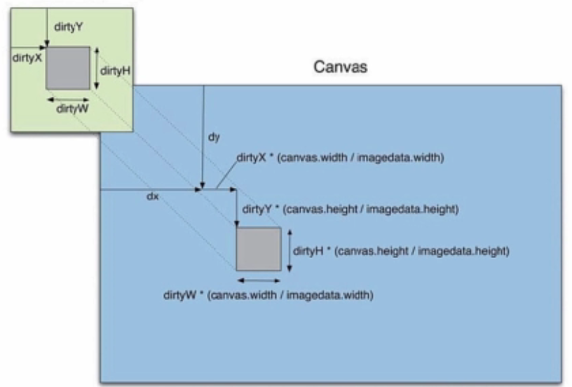

<h1><strong>canvas画布速查表</strong></h1>

<ul>
  <li>
    <strong style='font-size:16px;'>HTML5画布(Canvas)元素</strong>
    

    <pre>&lt;canvas id="myCanvas" width="500" height="300"&gt;</pre>
    <strong>浏览器不支持画布(canvas)时的备案</strong>
    <pre>&lt;canvas id="myCanvas" width="500" height="300"&gt;
        your browser doesn't support canvas!
    &lt;/canvas&gt;</pre>
    <strong>2d context</strong>
    <pre>var context = canvas.getContext('2d');</pre>
    <strong>Webgl context (3d)</strong>
    <pre>var context = canvas.getContext('webgl');</pre>
  </li>
  <li>
    <strong style='font-size:16px;'>图形</strong>
    

    <strong>绘制方形</strong>
    <pre>context.rect(x, y, width, height);
      context.fill();   //填充绘制 
      context.stroke(); //笔触绘制
    </pre>
    <strong>填充区域</strong>
    <pre>context.fillRect(x, y, width, height);
    </pre>
    <strong>绘制方形的边框</strong>
    <pre>context.strokeRect(x, y, width, height);
    </pre>
    <strong>绘制圆形</strong>
    <pre>
         context.arc(x, y, radius, 0, Math.PI * 2,false); //后面布尔参数是规定绘制的方向，false是默认的顺时针绘制 true是逆时针绘制。
         context.fill(); 
         context.stroke();
    </pre>
  </li>
  <li>
    <strong style='font-size:16px;'>风格</strong>
    

    <strong>填充样式</strong>
    <pre>context.fillStyle = 'red'; //也可以是字符串，16进制，16进制简写，RGB，RGBA
          context.fill();
    </pre>   
    <strong>勾勒(笔触)样式</strong>
    <pre>context.strokeStyle = 'red';//也可以是字符串，16进制，16进制简写，RGB，RGBA
         context.stroke();
    </pre>
    <strong>线性渐变</strong>
    <pre>
          var grd = context.createLinearGradient(x1, y1, x2, y2); //规定渐变的方向 长度。
          grd.addColorStop(0, 'red');   //规定线性渐变的起点位置 0-1之间，和颜色。
          grd.addColorStop(1, 'blue');  //规定线性渐变的第二种颜色的起点位置 before的位置-1之间，和颜色。（按需可以添加无数个）
          grd.addColorStop(1, 'blue');  //规定线性渐变的结束位置，和颜色。
          context.fillStyle = grd;
          context.fill();
    </pre>
    <strong>径向渐变</strong>
    <pre>
          var grd = context.createRadialGradient(x1, y1, radius1, x2, y2, radius2); //一个圆向两一个圆的径向渐变
          grd.addColorStop(0, 'red');  //和线性渐变原理类似
          grd.addColorStop(1, 'blue');
          context.fillStyle = grd;
          context.fill();
    </pre>
    <strong>图案</strong>
    <pre>
          var imageObj = new Image();
          imageObj.onload = function() {
          var pattern = context.createPattern(imageObj, 'repeat'); //使用图片填充canvas的背景
          context.fillStyle = pattern;
           context.fill();
          };
          imageObj.src = 'path/to/my/image.jpg';
    </pre>
    <strong>交点</strong>
    <pre>context.lineJoin = 'miter|round|bevel';</pre> //规定线段交点的样式 默认是miter
    <strong>线头</strong>
    <pre class="prettyprint">context.lineCap = 'butt|round|square';
    </pre>
    <strong>阴影</strong>
    <pre>
        context.shadowColor = 'black'; //阴影的颜色
        context.shadowBlur = 20;       //阴影的模糊程度
        context.shadowOffsetX = 10;    //阴影的X轴偏移位置
        context.shadowOffsetY = 10;    //阴影的Y轴偏移位置
    </pre> 
    <strong>Alpha(透明)（全局设置颜色透明度 默认是1不透明）</strong>
    <pre>context.globalAlpha = 0.5; // between 0 and 1
    </pre>
  </li>
  <li>
    <strong style='font-size:16px;'>颜色格式（适用于所有的用到颜色的场景）</strong>
    

    <strong>字符串</strong>
    <pre>context.fillStyle = 'red';
    </pre>
    <strong>16进制</strong>
    <pre>context.fillStyle = '#ff0000';
    </pre>
    <strong>16进制简写</strong>
    <pre>context.fillStyle = '#f00';
    </pre>
    <strong>RGB</strong>
    <pre>context.fillStyle = 'rgb(255,0,0)';
    </pre>
    <strong>RGBA</strong>
    <pre>context.fillStyle = 'rgba(255,0,0,1)';
    </pre>
  </li>
  <li>
    <strong style='font-size:16px;'>路径</strong>
    

    <strong>开始路径</strong>
    <pre>context.beginPath(); //开始一段新的路径
    </pre>
    <strong>画线</strong>
    <pre>context.lineTo(x, y);
    </pre> 
    <strong>弧形</strong>
    <pre>context.arc(x, y, radius, startAngle//开始弧度值, endAngle//结束弧度值, counterClockwise//绘制的方向 布尔值);
    </pre>
    <strong>二次赛尔曲线</strong>
    <pre>context.quadraticCurveTo(cx//控制点的X轴坐标, cy//控制点的Y轴坐标, x//结束点的X轴坐标, y//结束点的Y轴坐标);
    </pre>  
    <strong>三次赛尔曲线</strong>
    <pre>context.bezierCurveTo(cx1//第一个控制点的X轴坐标, cy1//第一个控制点的Y轴坐标, cx2//第二个控制点的X轴坐标, cy2//第二个控制点的Y轴坐标, x//结束点的X轴坐标, y//结束点的Y轴坐标);
    </pre>
    <strong>关闭路径(闭合路径)</strong>
    <pre>context.closePath();
    </pre>
  </li>
  <li>
    <strong style='font-size:16px;'>图片</strong>
    

    <strong>画图</strong>
    <pre>
        var imageObj = new Image();
        imageObj.onload = function() {
        context.drawImage(imageObj, x, y);
        };
        imageObj.src = 'path/to/my/image.jpg';
        </pre>
    <strong>指定尺寸画图</strong>
    <pre>
          var imageObj = new Image();
          imageObj.onload = function() {
          context.drawImage(imageObj, x, y, width, height);
          };
          imageObj.src = 'path/to/my/image.jpg';
    </pre>
    <strong>裁剪图片</strong>
    <pre>
          var imageObj = new Image();
          imageObj.onload = function() {
          context.drawImage(imageObj, sx, sy, sw, sh, dx, dy, dw, dh);
          };
          imageObj.src = 'path/to/my/image.jpg';
    </pre>
  </li>
  <li>
    <strong style='font-size:16px;'>文本</strong>
    

    <strong>写文字</strong>
    <pre>
        context.font = ' bold 40px Arial'; //设置字体的样式 可以设置的样式有font-size,font-family,font-weight,font-variant,font-style.
        context.fillStyle = 'red';         //设置绘制字体的颜色
        context.fillText('Hello World!', x, y); //填充绘制
    </pre>
    <strong>写镂空文字</strong>
    <pre>
          context.font = '40pt Arial'; //设置字体的样式 可以设置的样式有font-size,font-family,font-weight,font-variant,font-style.
          context.strokeStyle = 'red'; //设置绘制字体的颜色
          context.strokeText('Hello World!', x, y);   //笔触绘制
    </pre>
    <strong>粗体</strong>
    <pre>context.font = 'bold 40px Arial';
    </pre>
    <strong>斜体</strong>
    <pre>context.font = 'italic 40px Arial';
    </pre>
    <strong>对齐方式</strong>
    <pre>context.textAlign = 'start|end|left|center|right';  //水平对齐方式
    </pre>
    <strong>文字基线</strong>
    <pre>context.textBaseline = 'top|hanging|middle|alphabetic|ideographic|bottom';  //垂直对齐方式
    </pre>
    <strong>获取文本宽度</strong>
    <pre>var width = context.measureText('Hello world').width;  //获取文字的宽度
    </pre>
  </li>
  <li>
    <strong style='font-size:16px;'>动画</strong>
    

    <strong>移动</strong>
    <pre>context.translate(x, y);
    </pre>
    <strong>扩大缩小</strong>
    <pre>context.scale(x, y);
    </pre>
    <strong>旋转</strong>
    <pre>context.rotate(radians);
    </pre>
    <strong>水平翻转</strong>
    <pre>context.scale(-1, 1);
    </pre>
    <strong>上下翻转</strong>
    <pre>context.scale(1, -1);
    </pre>
    <strong>自定义变换</strong>
    <pre>context.transform(a, b, c, d ,e, f);
    </pre>
    <strong>设置变换</strong>
    <pre>context.setTransform(a, b, c, d ,e, f);
    </pre>
    <strong>切割</strong>
    <pre>context.transform(1, sy, sx, 1, 0, 0);
    </pre>
    <strong>重置</strong>
    <pre>context.setTransform(1, 0, 0, 1, 0, 0);
    </pre>
  </li>
  <li>
    <strong style='font-size:16px;'>状态存储（重要）</strong>
    

    <strong>存储</strong>
    <pre>context.save(); //一般和下面restore()成对出现
    </pre>
    <strong>恢复</strong>
    <pre>context.restore();
    </pre>
  </li>    
  <li>
    <strong style='font-size:16px;'>裁剪(按路径裁剪)</strong>
    

    <strong>裁剪</strong>
    <pre>// draw path here//绘制路径
          context.clip();
    </pre>
  </li> 
  <li>
    <strong style='font-size:16px;'>图像数据</strong>
    

    <strong>在画布上绘制图像(参数不同实现的功能也不同)</strong>
    <pre>
        context.drawImage(img,x,y); //在画布上定位图像：
        context.drawImage(img,x,y,width,height);//在画布上定位图像，并规定图像的宽度和高度：
        context.drawImage(img,sx,sy,swidth,sheight,x,y,width,height);//(其中sx,sy表示从图片的什么位置开始,swidth,sheight的大小，渲染到x,y的位置，并且渲染的宽高是wight,height)剪切图像，并在画布上定位被剪切的部分：
        context.drawImage(canvas,x,y);//其中也可以用canvas绘制到context上。方法也有上面三种，参数都是一样。
    </pre>
    <strong>获取图像数据</strong>
    <pre>
          var imageData = context.getImageData(x, y, width, height);
          //其中imageData包括data，width，height信息
          var data = imageData.data; //获取data信息
    </pre>
    <strong>遍历像素点</strong>
    <pre>
        var imageData = context.getImageData(x, y, width, height);
        var data = imageData.data;
        var len = data.length;
        var i, red, green, blue, alpha;
        for(i = 0; i &lt; len; i += 4) {
          red = data[i];
          green = data[i + 1];
          blue = data[i + 2];
          alpha = data[i + 3];
        }
    </pre>
    <strong>沿坐标遍历像素点</strong>
    <pre>
          var imageData = context.getImageData(x, y, width, height);
          var data = imageData.data;
          var x, y, red, green, blue, alpha;
          for(y = 0; y &lt; imageHeight; y++) {
            for(x = 0; x &lt; imageWidth; x++) {
              red = data[((imageWidth * y) + x) * 4];
              green = data[((imageWidth * y) + x) * 4 + 1];
              blue = data[((imageWidth * y) + x) * 4 + 2];
              alpha = data[((imageWidth * y) + x) * 4 + 3];
            }
          }
    </pre>
    <strong>绘制图像数据</strong>
    <pre>
         context.putImageData(imageData, x, y);//将一个已知的imageData放回带canvas画布中的x,y的位置。
         context.putImageData(imageData,x,y,dirtyX,dirtyY,dirtyW,dirtyH);//将imageData中的dirtyX,dirtyY位置开始的dirtyW,dirtyH大小的数据绘制到画布的x+dx,y+dy的位置
         //和drawImage（）有点像但是后面dirtyX,dirtyY的位移会累加前面的x和y。
         具体图示如下 
         
    </pre>
    <strong>创建imageData</strong>
    <pre>
        var imgData=context.getImageData();//获取imageDa
        var imgData=context.createImageData(width,height);//创建imageD
    </pre>
  </li> 
  <li>
    <strong style='font-size:16px;'>Data URLs</strong>
    

    <h5>获取Data URL</h5>
    <pre>var dataURL = canvas.toDataURL();
    </pre>
    <h5>使用Data URL生成图像</h5>
    <pre>
         var imageObj = new Image();
         imageObj.onload = function() {
         context.drawImage(imageObj, 0, 0);
         };
         imageObj.src = dataURL;
    </pre>
  </li> 
  <li>
    <strong style='font-size:16px;'>合成(全局设置)</strong>
    

    <strong>合成操作</strong> //也就是当后面绘制的图形叠压在前面绘制的图形上是呈现的状态
    <pre>context.globalCompositeOperation = 'source-atop|source-in|source-out|source-over|destination-atop|destination-in|destination-out|destination-over|lighter|xor|copy';
    </pre>
    
  </li>
  <li>
      <strong style='font-size:16px;'>测试某点的位置是否在绘制的区域内</strong>
      

      <strong>测试某点</strong> //也就是测试某点的位置是否在绘制的区域内
      <pre>cxt.isPointInPath(x,y); //返回布尔值
      </pre>
    </li>       
</ul>