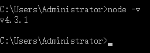

<h1>1. 安装nodejs</h1>

　　Grunt和所有grunt插件都是基于nodejs来运行的，安装nodejs非常简单，安装很简单。去&nbsp;<a href="https://nodejs.org/" target="_blank">https://nodejs.org/</a>&nbsp;上下载。

　　安装了nodejs之后，可以在控制台中输入“node -v”来查看nodejs的版本，查看nodejs是否安装成功。

　　

<h1>2. 创建一个简单的项目</h1>

　　Grunt是应用于实际项目的，所以我们得有一个简单的项目来演示grunt的安装、使用。

　　首先，我在电脑的D盘下面建了一个“grunt_test”文件夹，里面建了三个空文件夹、两个空文档，名称如下图。

　　

　　Package.json的内容我们写成如下格式：

　　

<h1>3. 安装grunt</h1>

　　接下来插件的安装，他们的安装过程和grunt一样。grunt插件

　　不在全局安装了，从控制台进入到网站或系统的具体目录下。这里我们进入 D:\grunt_test 目录下。然后输入以下命令。

　　

再运行这行命令。等一会儿，会提示安装成功。如下图：

　　

　　现在打开package.json看看，“devDependencies”和下图一样有变化？

　　

　　再看看文档目录中的文件或者文件夹有什么变化？多了一个“node_modules”文件夹，其中有一个“grunt”文件夹。

　　

　　然后你在控制台运行“grunt”命令。如果你得到一个warning提示，那说明grunt已经起作用了。如下图：

　　

　　经过以上三步，说明grunt已经在这个目录下成功安装。

<h1>4. 配置Gruntfile.js</h1>

　　Gruntfile.js 这个文件是为了grunt做某种配置的。按照grunt的规定，首先把Gruntfile.js配置成如下格式。

　　

　　我们再运行一下grunt命令。

　　

　　运行结果出现“Done, without errors”。继续。

　　

<h1>5. Grunt插件介绍</h1>

　　grunt官网的插件列表页面&nbsp;<a href="http://www.gruntjs.net/plugins" target="_blank">http://www.gruntjs.net/plugins</a>&nbsp;需要什么插件可以在插件页搜索。

　　插件分为两类。第一类是grunt团队贡献的插件，这些插件的名字前面都带有“contrib-”前缀，而且在插件列表中有星号标注。第二类是第三方提供的插件，不带有这两个特征。

<ul >
<li>Contrib-jshint——javascript语法错误检查；</li>
<li>Contrib-watch——实时监控文件变化、调用相应的任务重新执行；</li>
<li>Contrib-clean——清空文件、文件夹；</li>
<li>Contrib-uglify——压缩javascript代码</li>
<li>Contrib-copy——复制文件、文件夹</li>
<li>Contrib-concat——合并多个文件的代码到一个文件中</li>
<li>karma——前端自动化测试工具</li>
</ul>
<h1>6. 使用uglify插件（压缩javascript代码）</h1>

　　Uglify插件的功能就是压缩javascript代码。

　　要安装一个插件，你首先要进入这个插件在grunt官网的说明文档页面。我们在grunt官网插件列表页面，找到“contrib-uglify”点击进入。看里面的说明，然后根据说明进行安装。

　　安装uglify插件的方式，和安装grunt是一样的。

　　

　  安装完成之后， package.json中“devDependencies”节点的变化，以及“node_modules”文件夹里都会有变化。

　　现在还需要在Gruntfile.js 做配置。

　　创建一个js文件，写上一些内容

　　

　　测试文件建立好了。接下来就要把这个js文件进行压缩测试。

　　怎么压缩这些都需要配置，在Gruntfile.js中配置。分为三步：

　　第一步，在grunt.initConfig方法中配置 uglify 的配置参数。如下图：

　　

　　上图中，对uglify的配置有两项。

　　“options”中规定允许生成的压缩文件带banner，即在生成的压缩文件第一行加一句话说明。注意，其中使用到了pkg获取package.json的内容。

　　“build”中配置了源文件和目标文件。即规定了要压缩谁？压缩之后会生成谁？注意，我们这里将目标文件的文件名通过pkg的name和version来命名。

　　（PS：上文中说过的package.json的内容终于找到了他被应用的地方了。这样的好处是：例如，对文件版本的管理，你只需要在package.json中修改即可，grunt会自动根据最新的版本号生成相应版本的文件。你不用手动去修改文件的文件名。）

　　最后，这里只是对“options”和“build”的基本应用，还有许多中使用方式，可以去官网查阅。

　　第二步，在 grunt.initConfig 方法之后，要让grunt去加载这一个插件。

　　

　　第三步，在grunt命令执行时，要不要立即执行uglify插件？如果要，就写上，否则不写。

　　

　　以上说的这三步已经OK了，接下来我们去试试。在控制台中运行grunt命令，看得到什么结果。

　　控制台将输入如下信息：

　　

　　再去看看，是否生成了一个压缩后的js文件？

　　

　　果然。根据package.json中的name和version生成了文件名。而且，压缩后的代码的banner也是符合Gruntfile.js中的配置要求的。

　　接下来介绍jshint的安装和配置。

　　插件的安装和安装grunt、uglify没有任何差别，执行下面的命令

　　

　　配置jshint和配置uglify一样。在配置uglify时候是三个步骤，这里也是三个步骤。

　　第一步，在grunt.initConfig方法中配置jshint。

　　

　　和uglify的配置一样，分为“options”和“build”两个部分。“build”中描述了jshint要检查哪些js文档的语法。 “options”中描述了要通过怎么的规则检查语法，这些规则的描述文件就保存在网站根目录下的一个叫做“.jshintrc”的文件中。因此我们在网 站的根目录下面添加上这个文档，并且填写上文件内容。

　　

　　.jshintrc文件中代码的格式也要遵守严格的json语法，

　　第二步，加载插件。和uglify的加载方法一样。没有先后顺序。

　　

　　第三步，配置grunt命令启动时，要执行的任务，这里注意先后顺序。是希望先检查语法呢？还是先合并？

　　

　　以上三步配置完了之后，我们测试一下这个jshint到底怎么用。先故意将当前创建的test.js文件写一个语法错误。

　　

　　然后执行“grunt”命令，看jshint能识别出来这？结果如下：

　　

　　看到没有，jshint很清楚识别出了这两个错误。而且jshint错误之后呢，其后面的uglify就没有再继续执行。

　　修改完这些错误，在此执行grunt命令，结果没有提示错误，而且jshint和uglify都顺利执行了。

&nbsp;&nbsp;&nbsp;&nbsp;&nbsp;&nbsp;

<h1>7. 使用csslint插件（检查css语法错误）</h1>

　　检查css文件的语法错误要使用csslint插件，安装配置方法和jshint一样。

　　

<h1>8. 使用watch插件</h1>

　　 　　安装watch插件，安装和其他插件一样。配置watch插件，配置如下：

　　第一步。配置watch将监控哪些文件的变化，以及这些文件一旦变化，要立即执行哪些插件功能。如下图，watch将监控src文件夹下所有js文件和css文件的变化，一旦变化，则立即执行jshint和uglify两个插件功能。

　　

　　第二步，直接贴图

　　

　　第三步，直接贴图

　　

　　这三步执行完了，即watch插件配置完成。运行grunt命令，控制台提示watch已经开始监听。此时要想停止，按ctrl + c即可。

　　

　　既然在监听，我们试一试看监听有没有效。我们将 test.js 代码中去掉一个分号，看它能否自动检查出来这个错误。

　　

　　watch检查到了test.js文件的变化，而且通过执行jshint提示了语法错误。假如再把语法错误修复了。会怎样？

　　

　　检测到了文件变化，这次语法没有错误，它很顺利的执行了jshint和uglify，执行完毕之后重新进行监听

<h1>9. 上文中所谓的“build”</h1>

　　上文中描述各个插件的配置时，都是用了“build”这一名称作为一个配置项。

　　

　　那么这里是不是必须用“build”这一个名字。

　　这里可以用任何字符串代替“build”（但要符合js语法规则）。甚至，可以把“build”指向的内容分开来写。

　　

　　我对jshint的配置做了修改，然后执行grunt命令试试。命令行会有“test1”、“test2”的字眼。

<h1>11. 批量安装插件</h1>

　　到现在为止，我刚刚安装了3个插件，“node_modules”文件夹所占据的空间就有18MB了。大家猜一猜，我在上传代码到开发库的时候，会不会把“node_modules”中的内容也上传呢？既然我这么问了，答案肯定是不上传。

　　会把package.json上传上去，而package.json中的“devDependencies”就记录了这个系统的开发依赖项，然后通过nodejs的npm即可批量安装。

　　做个示范，新建一个目录“grunt_test_1”，然后把“grunt_test”中的package.json拷过去。在打开命令行跳转到“grunt_test_1”，执行“<strong>npm install</strong>”命令，会有什么结果。

　　

　　此时按回车执行命令，结果在“grunt_test_1”生成了“node_modules”文件夹，里面安装好了package.json中“devDependencies”配置的插件。而且，版本都是一直的。

　　

<h1>11. 系统文件结构</h1>

　　

　　上图中，“src”文件夹里面存储的是原始的代码文件，“dist”文件夹里面存储的是最终生成的代码文件，“demo”里面存储的是一些测试页面。

