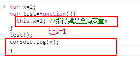

<h3>javascript的this学习</h3>

(this是JavaScript语言的一个关键字)调用this时，this指得是调用函数的那个对象， 
它表示函数运行时，自动生成的一个内部对象，只能在函数内部使用。

<ul>
<li><strong>情况一：纯粹的函数调用</strong> 

这是函数的最通常用法，属于全局性调用，因此this就是代表全局对象Global

 
</li>
<li><strong>情况二：作为对象方法的调用</strong> 

函数可以作为某个对象的方法调用，这是的this就指这个上级对象

 
</li>
<li><strong>情况三：作为构造函数的调用</strong> 

构造函数，就是通过这个函数new一个新的对象(object),这是 this值得就是这个新对象

 
</li>
<li><strong>情况四：apply的调用</strong> 

apply()是函数的一个方法，他的作用是改变函数的调用对象，他的第一个参数就表示改变后的调用这个函数的对象，因此this指的是这第一个参数。

 
</li>
</ul>
<h3>javascript的闭包学习</h3>

闭包就是能够读取其他函数内部变量的函数。

1,函数内部可以直接读取全局变量 
2,在函数外部无法自然读取函数内部的局部变量 
举个简单的闭包栗子： 
 
再看个简单的栗子： 
 
全局变量相当于在window下面 
 

<h3>javascript的面向对象编程(一)：封装</h3>

把'属性'和'方法'，封装成一个对象，甚至从原型对象生成一个实例对象的一些方法

<ul>
<li><strong>一，构造函数模式</strong> 
    
javascript提供了一个构造函数(constructor)模式。 
    就是一个普通函数，但内部使用了this变量，对构造函数使用new运算符，就能生成实例，并且this变量会绑定在实例对象上

    
</li>
<li><strong>Prototype模式 </strong> 
     
    
1,构造函数的方法很好用，但是如果有相同的属性或者方法就会存在内存的浪费

    
     
    
2,javascript规定每一个构造函数都有一个prototype属性，指向另一个对象，这个对象的所有属性和方法，都会被构造函数的实例继承。

    
    
3,prototype的验证方法(javascript定义了一些辅助方法，帮助大家使用它)

    
3.1,isPrototype()用来判断对象和某个实例之间的关系。

    
    
3.2,hasOwnProperty()用来判断一个属性到底是本地属性，还是继承自prototype对象的属性。

    
    
3.3,in用来判断某个实例是否含有此属性，不管是本地还是其他还是继承自prototype对象的属性。

    
</li>
</ul>
<h3>javascript的面向对象编程(二)：构造函数的继承</h3>

对象与对象之间的继承

假如现在有一'动物'的构造函数
<pre>
function Animal(){  
  this.species="动物"; 
} </pre>
现在还有一个'猫'对象的构造函数。
<pre>
function Cat(name,color){ 
    this.name=name; 
    this.color=color; 
} 
</pre>
如果要让'猫'继承'动物'的属性或者方法呢（请看下面）
<ol>
<li><strong>、构造函数绑定</strong> 

用call或者apply方法，将父对象的构造函数绑定在子对象上，即在子对象构造函数中加一行

<pre>
function Cat(name,color){ 
    Animal.apply(this,arguments); 
    this.name=name; 
    this.color=color; 
} 
var cat1=new Cat("大黄","黄色"); 
var cat2=new Cat("小黄","白色"); 
console.log(cat1.species);//动物 </pre>

</li>
<li><strong>、prototype模式</strong> 

如果'猫'的prototype对象，指向一个Animal的实例，那么所有猫的实例就继承了Animal的属性了

<pre>
function Cat(name,color){ 
    this.name=name; 
    this.color=color; 
} 
Cat.prototype=new Animal(); 
//完全删除了prototype对象原先的值，然后将Cat的prototype对象指向一个Animal的实例 
Cat.prototype.constructor=Cat; 
//任何一个prototype对象都有一个constructor属性，指向它的构造函数。如果没有"Cat.prototype = new Animal();"这一行，Cat.prototype.constructor是指向Cat的； 
//*****(以后都应注意)加了这一行以后，Cat.prototype.constructor指向Animal。 
var cat1=new Cat("大黄","黄色"); 
console.log(cat1.species);//动物 </pre>

</li>
<li>
<strong>、直接继承prototype模式</strong> 

这一种是对上一种的改进，由于Animal对象中，不变的属性都可以直接写入Animal。prototype。所以，我们也可以是让Cat();方法跳过Animal()；直接继承Animal.prototype

<pre>
function Animal(){} 
Animal.prototype.species="动物"; 
//然后将Cat的prototype对象指向Animal的prototype对象。 
function Cat(name,color){ 
    this.name=name; 
    this.color=color; 
} 
Cat.prototype=Animal.prototype; 
Cat.prototype.constructor=Cat;
var cat1=new Cat("大黄","黄色");
console.log(cat.species);//动物
</pre>

以前一种方法比，这样做的效率很高，不要执行和建立Animal实例了，比较省内存，缺点是Cat和Animal现在指向了同一个对象，那么对Cat.prototype修改，也同时会影响到Animal.prototype。

<pre>
//看这一句
Cat.prototype.constructor=Cat;
console.log(Animal.prototype.constructor);//Cat
</pre>

</li>
<li>
<strong>、利用空对象作为中介</strong> 

由于"直接继承prototype"存在上述缺点，所以就有了利用空对象作为中介。

<pre>
function Animal(){}; 
Animal.prototype.species="动物"; 
function Cat(name.color){ 
    this.name=name; 
    this.color=color; 
} 
var F=function(){}; 
F=Animal.prototype; 
Cat.prototype=new F(); 
Cat.prototype.constructor=Cat; 
var cat1=new Cat("大毛","黄色"); 
console.log(Cat.constructor===Cat);//true 
console.log(Animal.constructor===Cat);//false 
console.log(cat1.species);//动物 
</pre>
我们将上面的方法封装成一个方法
<pre>
function extend(Child,Parent){
    var F=function(){}; 
    F=Parent.prototype; 
    Child.prototype=new F(); 
    Child.prototype.constructor=Child; 
}
</pre>

</li>
<li>
<strong>、拷贝继承</strong> 

我们也可以采用'纯粹的拷贝'方法实现继承。简单的说，就是把父对象的所有属性和方法都拷贝进子对象。 
我们还是把Animal的所有不变的属性，都放到prototype上面

<pre>
function Animal(){} 
Animal.prototype.species="动物"; 
function Cat(name.color){ 
    this.name=name; 
    this.color=color; 
} 
function extend(Child,Parent){ 
    var p=p.prototype; 
    var c=Child.prototype; 
    for(var i in p){ 
        c[i]=p[i]; 
    } 
} 
extend(Cat,Animal); 
var cat1=new Cat("大毛","黄色"); 
console.log(cat1.species);</pre>
</li>

</ol>
<h3>javascript的面向对象编程(三)：非构造函数的继承</h3>
<ol>
<li><strong>什么是'非构造函数'的继承</strong> 
比如，现在有一个对象，叫做'中国人';
<pre>
var Chinese={ 
    nation:'中国' 
}
</pre>
现在还有一个对象，叫做'医生';
<pre>
var Doctor={ 
    career:'医生' 
}
</pre>

怎么才能让医生继承中国人被，这两个都是普通函数，无法使用构造函数继承，下面就介绍一些思路

</li>
<li>
<strong>object()方法</strong> 
<pre>
var Chinese={ 
    nation:'中国' 
}
function object(obj){
    function F(){}
    F.prototype=obj;
    return new F();
}
var Doctor=object(chinese);
Doctor.career="医生";
console.log(Doctor.nation);//中国
</pre>

</li>
<li>
<strong>浅拷贝方法</strong> 

除了使用'prototype链'以外，还有另一种思路，把父对象的属性，全部拷贝给子对象，也能实现继承

<pre>
function extend(p){ 
    var c={}; 
    for(var i in p){ 
        c[i]=p[i]; 
    } 
    return c; 
} 
var Doctor=extend(chinese); 
Doctor.career="医生"; 
console.log(Doctor.nation);//中国 
</pre>

但是这样拷贝存在一个问题,如果父对象的属性等于数组或另一个对象，那么实际上，子对象获得的只是一个内存地址，而不是真正拷贝，因此存在父对象被篡改的可能。

<pre>
chinese.birthPlace=["北京","上海","成都","广州"]; 
Doctor.birthPlace.push("南充"); 
console.log(Doctor.birthPlace);//["北京","上海","成都","广州","南充"]; 
console.log(chinese.birthPlace);//["北京","上海","成都","广州","南充"]; 
</pre>

</li>
<li>
<strong>深度拷贝方法</strong> 

所谓"深拷贝"，就是能够实现真正意义上的数组和对象的拷贝，它的实现并不难，只要递归调用"浅拷贝"就OK

<pre>
function deepCopy(Child,Parent){ 
    var c=Child || {}; 
    for(var i in Parent){ 
        if(typeof p[i]=='object'){ 
            c[i]=(p[i].constructor === Array?[]:{}) 
            deepCopy(c[i],p[i]); 
        }else{ 
            c[i]=p[i]; 
        } 
    } 
    return c; 
} 
var Doctor=deepCopy(chines); 
Doctor.birthPlaces.push('南充'); 
console.log(Doctor.birthPlace);//["北京","上海","成都","广州","南充"] 
console.log(chinese.birthPlace);//["北京","上海","成都","广州"]
</pre>

</li>
</ol>

