<h3>JS的一些冷知识学习</h3>

<ol><strong>console知识(清空控制台方法)</strong> 
<li>
 在控制台内，选择右键快捷键菜单：Clear console
</li>
<li>
  在控制台内输入clear()
</li>
<li>
   在控制台内，选择左上角的： 
   
</li>
<li>
第四种 用于JavaScript代码中 
<pre>
console.clear();
</pre>
</li>
</ol>

<ol><strong>console知识(控制台API)</strong> 
<li>
console.log(); 
log方法可以将括号内一个或多个表达式一字符串的形式输出至控制台，
各个表达式之间用逗号隔开，逗号的效果与加法一样。
<pre>
console.log("abcd",$("body").text(),"test","haha");
</pre>
</li>
<li>
可以给console添加格式化字符串： 
console与C语言的printf类似，具体支持的格式化类型见后面表格
<pre>
console.log("%cJS-test","font-size:30px;color:red;"); //%c的用法 添加樣式
</pre>
結果如下： 
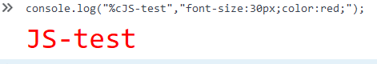 
<pre>
console.log("%sJS-test","test test test"); //%s的用法 字符串替代
</pre>
結果如下： 
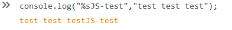 
<pre>
console.log("%dJS-test","3.4343"); //%d的用法   转化成数字整形替代，若非数字则以0替代
console.log("%fJS-test","3.4343"); //%f的用法   转化成浮点数替代， 若非数字则以NaN替代
//例:
console.error("Error:%s(%i)","not defied",300.34);
console.warn("warn:%s(%f)","not defied",3);
</pre>
結果如下： 
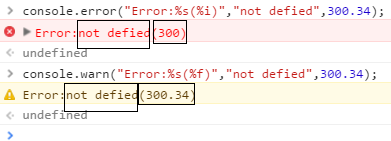 
官方文档如下： 
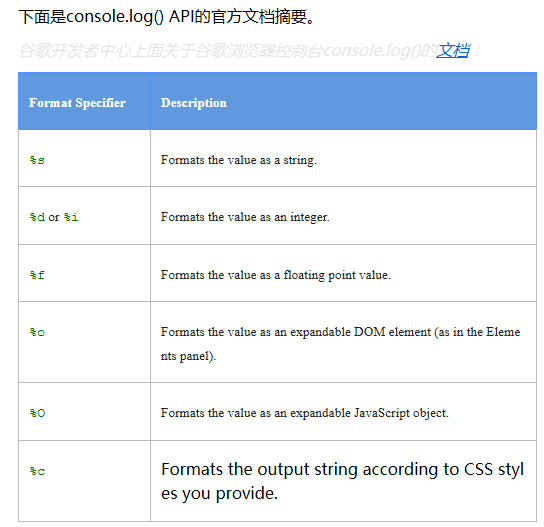
</li>
<li>
console的错误和警告信息(两者都不会阻断代码的运行) 
console.warn() --输出警告信息 
console.error() --输出错误信息 
</li>
<li>
断言(当第一个参数boolean计算结果为false时，将第二个参数string输出至控制台) 
console.assert(boolean,string);//可用来判断某些程序正确性
结果如下： 
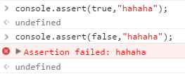 
</li>
<li>
输出信息的分组显示 
<pre>
console.group("代码调试信息");
console.warn("error%s(%i)","not error",300);
console.group("小组调试");
console.error("%s","小组");
console.log("%s%f","ok\t",4.434);
console.groupEnd();
console.groupEnd();
</pre>
结果如下： 
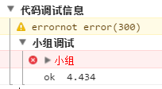
</li>
<li>
以JavaScript对象格式化DOM元素,默认情况下，console.log()将以XML形式展开DOM元素 
console.log(document.body); 
结果如下: 
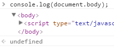 
如果希望看到元素拥有的属性和值，那么就用到console.dir()方法 
console.dir(document.body); 
结果如下： 
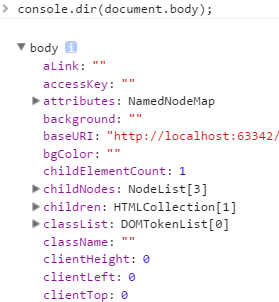
</li>
<li>测量代码执行的时间 
console.time(nameString)和console.timeEnd(name); 
控制台输出至执行console.time(nameString)方法开始，直到与到console.timeEnd(nameString)方法的累计时间，单位为ms。
其中nameString 只是为了console.timeEnd()检测。例： 
<pre>
function test(){
    var b=0;
    b+=1;
}
console.time("test");
test();
console.timeEnd("test");
</pre>
结果如下: 
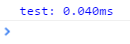 
</li>
<li>console.table(以表格的形式输出数据) 
举个栗子： 
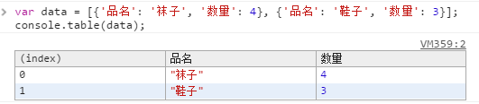
</li>
</ol>

<strong>浏览器地址栏</strong>
<ol>
<li>
浏览器地址运行JavaScript代码,但是必须以 JavaScript: 开头，后面跟执行语句。 
举一个栗子： 
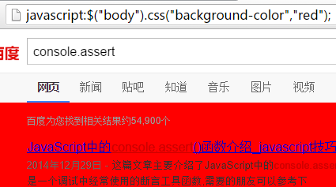
</li>
<li>
浏览器地址运行html代码，以data:text/html,开头 
例如: 
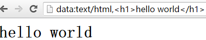
</li>
<li>
将浏览器当编辑器: 
结果如下: 
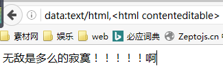 
</li>
<li>将页面变得可编辑状态 
<pre>
document.body.contenteditable='true';//将此代码在控制台输入
</pre>
结果如下: 
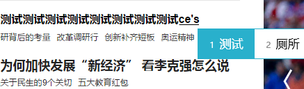
</li>
</ol>

<h3><strong>利用script标签保存html信息(需要设置type='text')</strong></h3>
例： 
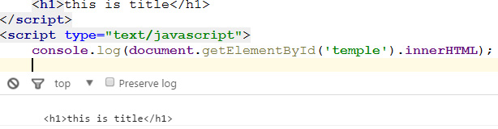 
<h3><strong>css多重边框(box-shadow)</strong></h3>
<pre>
div {
    box-shadow: 0 0 0 6px rgba(0, 0, 0, 0.2), 0 0 0 12px rgba(0, 0, 0, 0.2), 0 0 0 18px rgba(0, 0, 0, 0.2), 0 0 0 24px rgba(0, 0, 0, 0.2);
    height: 200px;
    margin: 50px auto;
    width: 400px
}
</pre>
结果如下: 
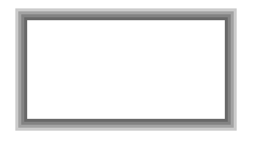

