
<strong>1.YSlow的使用教程</strong>

1.安装

<ul>
<li>Firefox安装： 
1、进入<a href="https://addons.mozilla.org/en-US/firefox/addon/yslow/">Firefox插件主页</a>添加对于版本的YSlow插件（注意Firefox中的YSlow要配合firebug使用）； 
2、或者在Firefox的组件中心搜索添加YSlow插件。 
 安装好后打开firebug审查元素最后会出现YSlow选项卡。如图： 
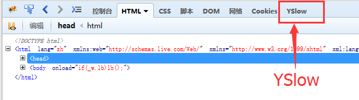
</li>
<li>chrome安装:  
1、直接下载YSlow插件，在打开chrome的扩展程序，讲下载的YSlow插件（以.cxr结尾）拽入扩展程序面板即可。 
2、也可在扩展程序中获取更多扩展程序中搜索并添加YSlow插件，也就是<a href="https://chrome.google.com/extensions/detail/ninejjcohidippngpapiilnmkgllmakh#">chrome插件中心</a>。（有时候打不开）
 安装好后浏览器顶部会出现YSlow选项卡。如图： 
 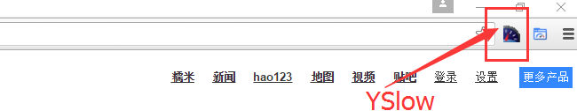
</li>
</ul>

2.Firefox和chrome中使用YSlow

<ul>
<li>
1、如果是Firefox打开需要测试的网页，打开firebug，选择YSlow选项卡点击run test按钮 
如果是chrome打开需要测试的网页，点击浏览器顶部右边的YSlow按钮选项卡在点击run test按钮 
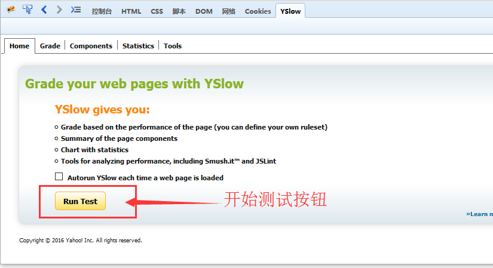 
2、分析测试结果： 选择YSlow第二个选项卡。 
其中可以查看测试结果的分数，等级，以及每个单项的等级，和具体的建议。 
这些准则是根据相对于性能的重要性来排列顺序，分别从A级到F级，A级为最高。如果页面与某一个规则无关，则显示N/A。如图： 
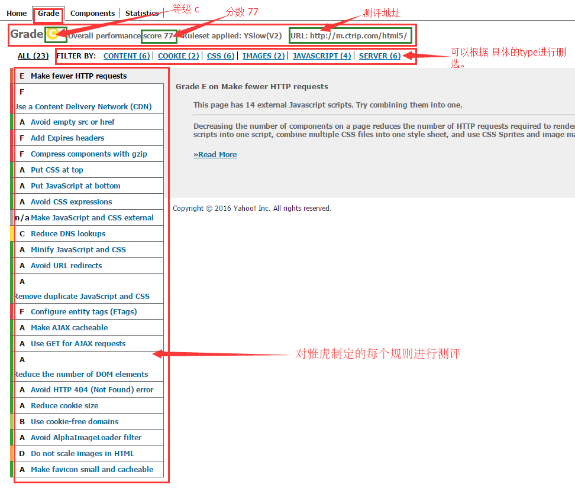 
3、选择YSlow的第三个选项卡。 
其中可以查看具体的网页组件检视表： 
type：该组件的类型。 
size(kb)：该组件的gizp压缩的大小。 
cookie(bytes)：cookie在http请求头的字节数。 
header：http信息头。点击放大镜查看全面信息。 
url：链接地址。 
expires(Y/M/D)：日期的expire头。属于缓存的一种。 
response time：响应时间。 
etag：etag响应头，设置缓存的一种。 
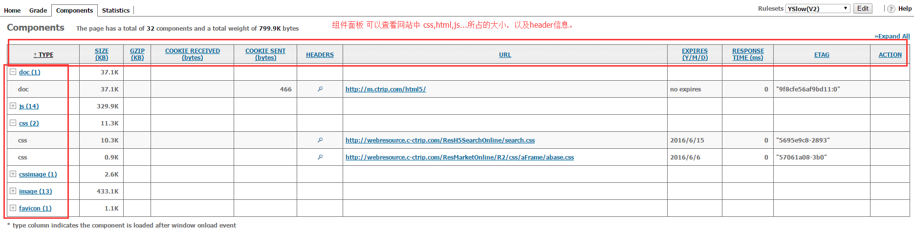 
3、选择YSlow的第三个统计信息视图。 
左边图是显示没空缓存的加载情况。 
右边是页面使用缓存的加载情况 
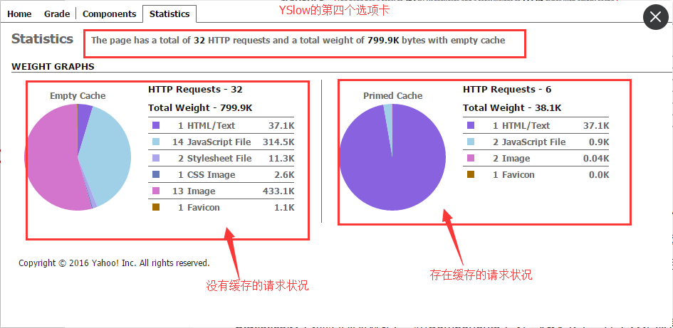
</li>
<li>总结： 
YSlow法则指出：用户的响应时间的80%花费在前端，其中最主要的部分用在下载文档中的图片、js、css、flash等资源上。相对于页面渲染，HTTP请求的开销是较大的。 
YSlow的优化目的是为了减少页面的请求数、降低请求所占的带宽、减少资源的浪费。 
其中主要的根据谷歌指定的22条准则进行测评并提供建议。
</li>
</ul>
 
 
 

<strong>2.fiddler的使用教程</strong>

1.安装

<ul>
<li>进入fiddler官网下载安装喜欢的磁盘： </li>
<li>打开fiddler，显示如下界面 
其中面板顶部操作栏的意思分别是：<br/
：给每一个会话设置注释 
：让当前选择的会话回放 
：清除会话（下拉框可以选择具体要清除的会话） 
：跳出当前会话 
：选择流模式 
：解压请求 
：保持会话（下拉框可以选择某一类型的会话） 
：监听浏览器端口 
：查找会话 
：储存当前页面选择的会话 
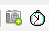：添加屏幕快照捕获按住shift键跳过倒计时 
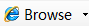：打开浏览器 
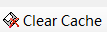：清除缓存 
：编码或解码 
：分离面板 
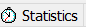：数据统计 
：请求详情 
：文件代理 
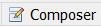：前后端借口连调 
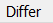：页面会话对比 
：网站新能分析 
1、可以在请求详情中查看每个请求内容 
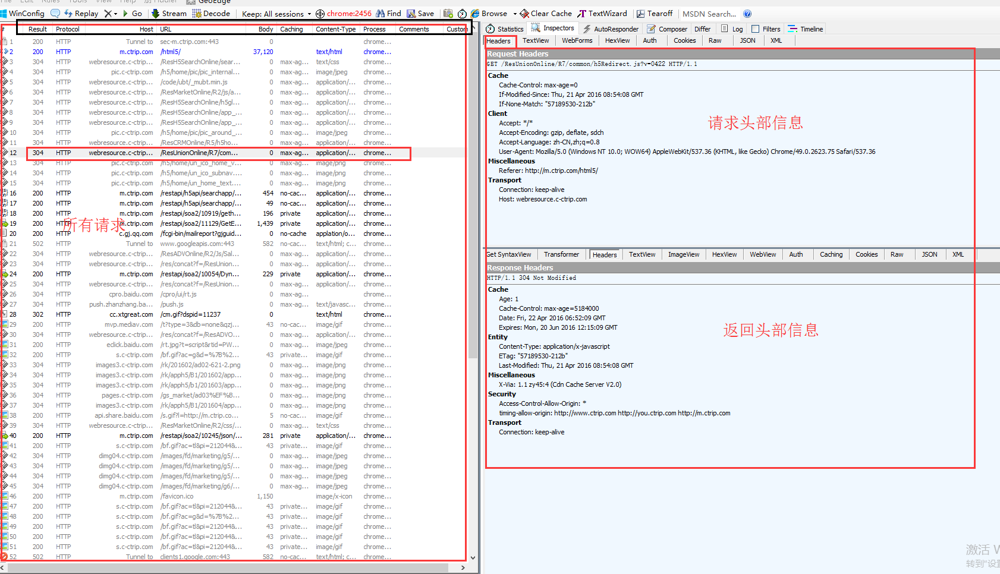  
2、可以查看客户端请求到服务器响应中的每一步。 
 
3、可以查看所有请求的响应时间 
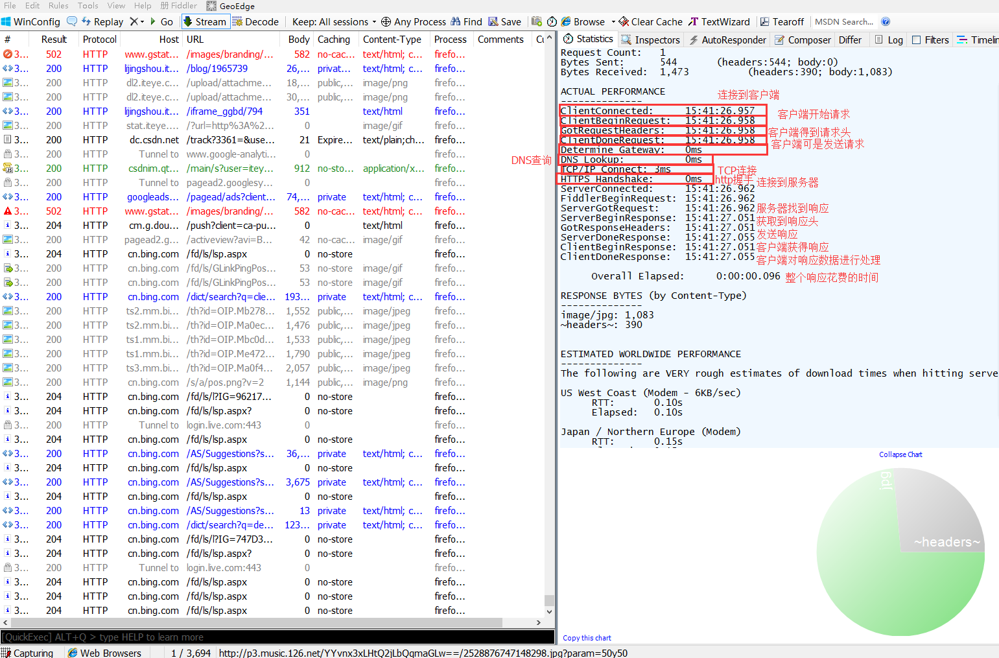 
</li>
<li>总结：fiddler主要是对http抓包，可以查看所有请求每一步所花的时间，响应内容HTTP统计视图，等等..</li>
</ul>

