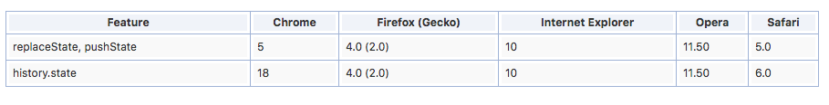

<h1>浏览器的历史记录(window.history对象)学习</h1>

 window.history对象在编写时可以省略window这个前缀。

 
<h3>history在HTML5之前提供了</h3>
<ul>
<li>history.back()-与在浏览器点击后退按钮相同
</li>
<li>history.forward() -与在浏览器中前进按钮一样
</li>
<li>history.go() 传入length参数 -  这个方法可以从session历史中载入特定的页面。(IE方法支持go()方法传入url参数)。 
    history.go(-1) 后退一格历史 
    history.go(1) 前进一个历史 
    history.go(2) 前进两个历史等等。。。
</li>
</ul>

<h3>在HTML5中引入 两个新API history.pushState()和 history.replaceState()两个方法</h3>

pushState与replaceState接口操作改变浏览器历史，并且改变当前页面,pushState是将指定的URL添加到浏览器历史里，replaceState是将指定的URL替换成当前的URL.
 这两种方法会和window.onpopstate事件一起工作

<ul>
    <li><b>调用方式：（两者相似）</b> 
    <pre>
        var state={
            title:title,
            url:url,
            otherKey:otherValue //除了上面的title与url之外，也可以添加其他数据 比如：还想将一些发送给ajax的配置信息给保存起来。
        };
        window.history.pushState(state,document.title,url);
    </pre>
    </li>
    <li><b>history.pushState()方法</b>
    
某项操作（例如点击某个按钮进行Ajax请求操作）讲此次记录（数据），地址使用history.pushState塞到浏览器的历史记录中。 
        浏览器的前进与后退，会触发window.onpopstate事件，通过绑定popstate事件，就可以根据当前的URL地址中的查询内容让对应的菜单执行Ajax载入。 
        实现Ajax的前进与后退效果。
    

    <pre>
        {
            //某项操作下，此次记录推入历史记录中
            history.pushState(state,document.title,url);
        }
        if(history.pushState){
            window.addEventLister('popstate',function(){
                //code in here...
                //ajax请求
            });
        }
    
    </pre>
    
后退时将 页面地址变为pushState()里的url参数

    </li>
    <li><b>history.replaceState()方法</b>
    
这个API的操作与history.pushState()用法一样 意思是替换当前的url,早某些用户交互情况下很适合

    <pre>
        {
            //某项用户交互下，此次当前URL替换成指定URL 并进行一些操作
            history.pushState(state,document.title,url);
        }
        if(history.pushState){
            window.addEventLister('popstate',function(){
                //code in here...
                //ajax请求
            });
        }
    </pre>
    </li>
</ul>

<h3>浏览器的兼容性</h3>

